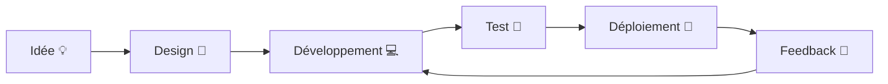
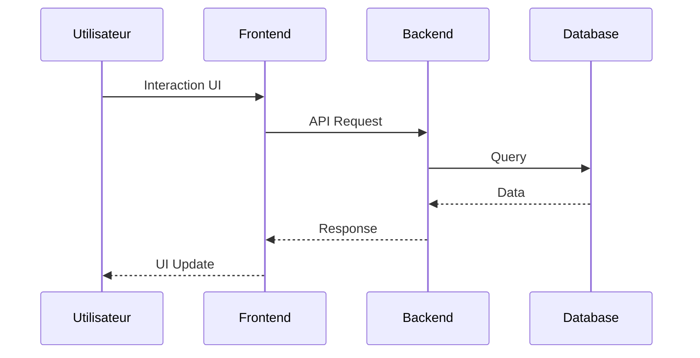

# 👋 Salut, moi c’est **<TON_NOM>**

  

---

## 🚀 À propos de moi

* 💼 Rôle : **<Ton rôle (ex: Full‑Stack Developer)>**
* 🌍 Localisation : **<Pays / Ville>**
* 🧠 Intérêts : **<Tech, design, IA, etc.>**
* 🎯 Objectif actuel : **<Ce sur quoi tu travailles>**

---

## 🧩 Stack & Outils

  

> ✏️ Modifie la liste selon ton stack (voir [https://skillicons.dev](https://skillicons.dev))

---

## 📊 Diagramme – Mon workflow de dev

> ✅ Les diagrammes Mermaid sont supportés nativement par GitHub

---

## 📈 Statistiques GitHub (auto‑animées)

  
  

  

---

## 🧠 Architecture type de projet

---

## ✨ Projets mis en avant

| Projet               | Description                   | Tech            |
| -------------------- | ----------------------------- | --------------- |
| 🔥 **Nom du projet** | Courte description impactante | React, Node     |
| ⚡ **Nom du projet**  | Ce que ça résout              | Python, FastAPI |

---

## 🌐 Me contacter

  
  
  

---

  

---

### 🛠️ Conseils

* Garde le README **court mais vivant**
* Évite de surcharger avec trop de stats
* Mets à jour régulièrement tes projets

---

💡 *Tu peux forker ce README et l’adapter à ton style personnel.*
