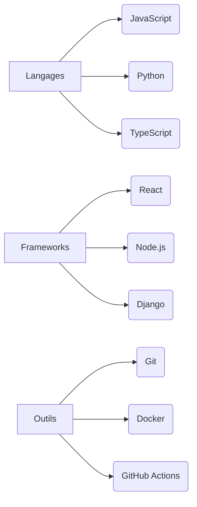
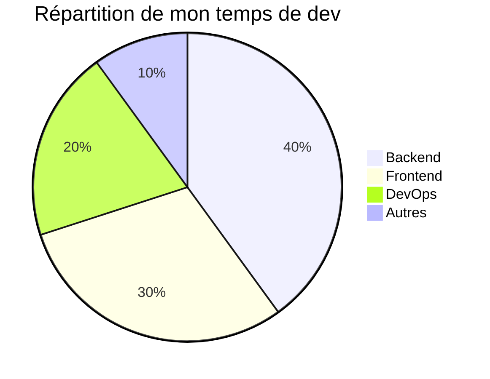
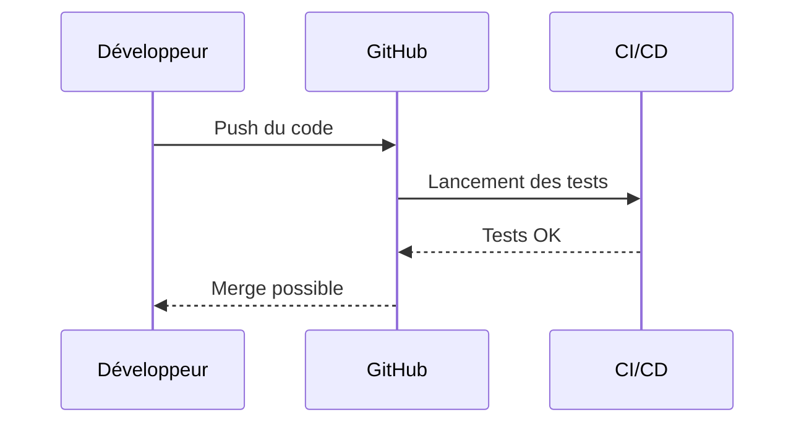
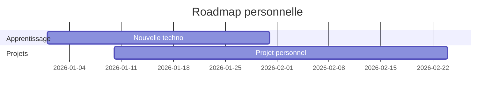

# 👋 Salut, moi c'est <Ton Nom>

> *Une courte phrase qui résume qui tu es ou ce que tu aimes construire.*

---

## 🧠 À propos de moi

* 💻 Développeur·se **<stack principal>**
* 🌱 J'apprends actuellement **<technos / sujets>**
* 🎯 Objectif actuel : **<objectif clair>**
* ⚡ Fun fact : **<quelque chose d'humain>**

---

## 🛠️ Stack technique

### Langages & Outils



---

## 📊 Ce que je fais le plus



---

## 🚀 Projets mis en avant

| Projet          | Description                      | Tech         |
| --------------- | -------------------------------- | ------------ |
| 🔗 **Projet A** | Description courte et impactante | React · Node |
| 🔗 **Projet B** | Problème résolu / valeur ajoutée | Python · API |
| 🔗 **Projet C** | Ce que tu as appris              | Docker · CI  |

---

## 🧩 Workflow de développement



---

## 📈 Statistiques GitHub

> ⚠️ Remplace `<username>` par ton pseudo GitHub

```md


```

---

## 🌍 Me contacter

* 💼 LinkedIn : <lien>
* 🐦 Twitter / X : <lien>
* ✉️ Email : <email>
* 🌐 Portfolio : <site>

---

## 🧪 En ce moment



---

⭐ *N'hésite pas à laisser une étoile sur les projets que tu aimes !*
