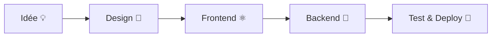

<!-- Hero Section -->

<h1 align="center">👋 Salut, moi c'est TonNom</h1>
<h3 align="center">🚀 Développeur | 💡 Créateur | 🌍 Tech Enthusiast</h3>

  

---

## ✨ À propos de moi

* 🔭 Je travaille actuellement sur **des projets modernes et performants**
* 🌱 J'apprends en continu (**Frontend, Backend, DevOps, UI/UX**)
* 🎯 Objectif : **Créer des produits utiles et élégants**
* ⚡ Fun fact : *Je transforme le café en code*

---

## 🧠 Stack & Technologies

  

---

## 📊 Diagramme de compétences

```mermaid
flowchart LR
    A[Idée 💡] --> B[Design 🎨]
    B --> C[Frontend ⚛️]
    C --> D[Backend 🧩]
    D --> E[Test & Deploy 🚀]
```

---

## 📈 GitHub Stats

  
  

  

---

## 🚀 Projets mis en avant

| Projet       | Description             | Tech              |
| ------------ | ----------------------- | ----------------- |
| 🌐 Portfolio | Site personnel moderne  | Next.js, Tailwind |
| 📱 App       | Application interactive | React, Node       |
| ⚙️ API       | API performante         | Express, MongoDB  |

---

## 🌍 Me retrouver ailleurs

  
  
  

---

## 🐍 Animation contribution

  

---

✨ Merci de ta visite — n'hésite pas à explorer mes repos ✨

