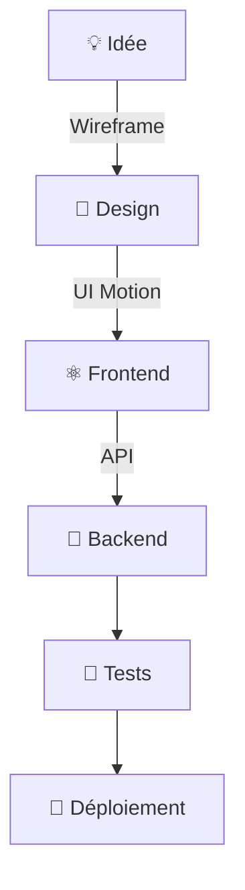

<!-- Animated Banner -->

  

<!-- Typing Animation -->

  

---

## 🧩 Qui suis-je ?

  

* 💡 J’aime concevoir des expériences **visuelles & fluides**
* 🎨 Sensible au **design, animations et micro-interactions**
* ⚙️ Du concept → au déploiement
* ☕ Café + musique = productivité maximale

---

## ⚡ Stack animée

  

  

---

## 🌀 Workflow visuel

```mermaid
flowchart TD
    A[💡 Idée] -->|Wireframe| B[🎨 Design]
    B -->|UI Motion| C[⚛️ Frontend]
    C -->|API| D[🧠 Backend]
    D --> E[🧪 Tests]
    E --> F[🚀 Déploiement]
```

---

## 📊 Activité GitHub animée

  
  

  

---

## 🚀 Projets en mouvement

  
  

---

## 🐍 Animation des contributions

  

---

## 🌐 Connexions

  
  
  

---

  

