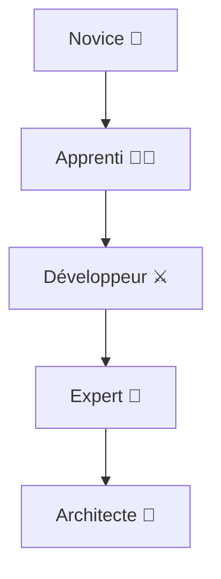

<!-- RPG Banner -->

<p align="center">
  
</p>

<p align="center">
  
</p>

---

## 🧙‍♂️ Fiche du personnage

```yaml
Nom: Yanis
Classe: Développeur Full Stack
Alignement: Chaotique Bon 😄
Niveau: ███████░░░ 72%
Expérience: En constante évolution
Arme favorite: Clean Code ⚔️
Compagnon: ☕ Café
```

---

## 🗺️ Carte des compétences

<p align="center">
  
</p>

---

## 🧬 Arbre de progression


```mermaid
flowchart TD
    A[Novice 👶] --> B[Apprenti 🧑‍🎓]
    B --> C[Développeur ⚔️]
    C --> D[Expert 🧠]
    D --> E[Architecte 🏰]
```

---

## 🧪 Statistiques du héros

<p align="center">
  
</p>

<p align="center">
  
</p>

---

## 📜 Quêtes principales

| 🗡️ Quête | 📖 Description          | 🎁 Récompense   |
| --------- | ----------------------- | --------------- |
| Portfolio | Créer un site personnel | XP + Design     |
| App Web   | Application interactive | XP + Logic      |
| API       | Backend scalable        | XP + Robustesse |

---

## 🏆 Hauts faits

<p align="center">
  
</p>

---

## 🐍 Invocation du serpent ancien

<p align="center">
  
</p>

---

## 🌌 Portails sociaux

<p align="center">
  <a href="https://linkedin.com/in/tonprofil"></a>
  <a href="https://twitter.com/tonprofil"></a>
</p>

---

<p align="center">
  
</p>
